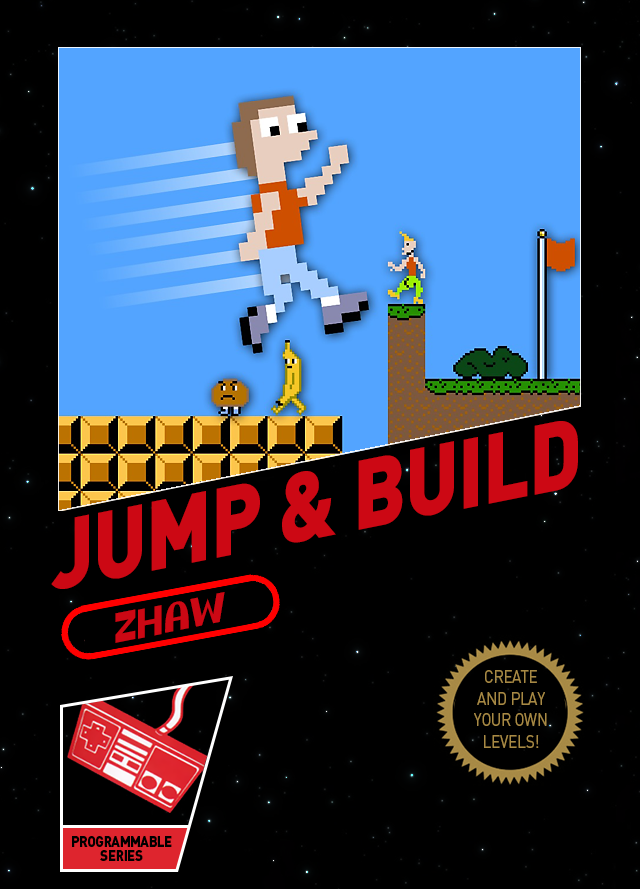

## Development environment

You can build or run the project using Gradle.

### Build

Compile the project:

```
gradle build
```

### Run

Run the game:

```
gradle runGame
```

Run the editor:

```
gradle runEditor
```
